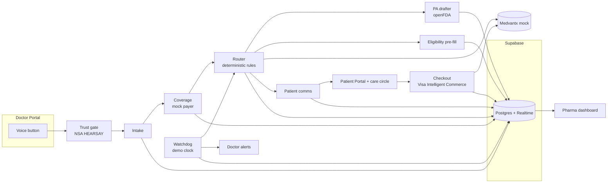

# Relay — Build Plan (HackGT 13)

One website, three portals (Doctor, Patient, Pharma), ten agents, one flawless demo. This file is the step-by-step playbook from zero to submission. `CLAUDE.md` is the rulebook the coding agent follows.

---

## 0. What we are building, in one screen

| Portal | Who | Core job |
| --- | --- | --- |
| Doctor (`/doctor`) | Prescriber and staff | Speak one sentence, watch agents work live, approve PA / enrollment, get alerts |
| Patient (`/patient/[id]`) | Patient + family care circle | Understand the plan in their language, track the medicine, approve and pay |
| Pharma (`/pharma`) | Impiricus's pharma clients | See scripts rescued, time to therapy, program mix, underserved reach, audit trail |
| Demo panel (`/demo`) | Us, during judging | Reset, fast-forward the clock, trigger a PA denial |

Agent chain: **Voice → Trust gate → Intake → Coverage → Router → PA drafter / Eligibility → Patient comms → Checkout (Visa) → Watchdog**. Trial matcher is a stretch goal.

---

## 1. Setup from zero (do this in the first 60–90 minutes)

### 1.1 Accounts (one person, before coding starts)

- [ ] GitHub org or repo `relay-hackgt` (public — Meta requires a public repo)
- [ ] Supabase project (free tier) → copy URL, anon key, service role key
- [ ] Vercel account linked to GitHub
- [ ] xAI / Grok API key — get the hackathon credits from the SpaceXAI booth
- [ ] Ask SpaceXAI booth: is Grok Voice available via API for us? (decides the voice path in Phase 2)
- [ ] Ask Visa booth: can we get Visa Developer sandbox access for Intelligent Commerce / the MCP server? (decides real vs mock in Phase 6)
- [ ] Notability Pro active on one teammate's device; record all sponsor conversations
- [ ] Download the NSA HEARSAY training + test sets

### 1.2 Tools on every laptop

- [ ] Node.js LTS (20+), npm, Git
- [ ] Python 3.11+ (only for whoever owns HEARSAY)
- [ ] **Cursor** (required for the SpaceXAI prize — the challenge says build with Cursor using Grok)
- [ ] **Claude Code** — install per the official docs: https://docs.claude.com/en/docs/claude-code/overview (npm package `@anthropic-ai/claude-code`), then run `claude` in the repo and log in

> How Cursor and Claude Code fit together: open the repo in Cursor, and run `claude` in Cursor's built-in terminal. You get Cursor as the editor (SpaceXAI requirement) and Claude Code as the agent that writes most of the code. The product itself calls Grok at runtime. Confirm with the SpaceXAI booth that this setup counts; if they want Cursor's own agent used, use it for part of the build and screenshot it.

### 1.3 Create the repo

```bash
npx create-next-app@latest relay --ts --tailwind --eslint --app --src-dir=false --import-alias "@/*"
cd relay
npx shadcn@latest init
npx shadcn@latest add button card badge dialog input tabs table toast avatar progress separator sheet dropdown-menu tooltip skeleton
npm i @supabase/supabase-js openai zod framer-motion lucide-react recharts clsx date-fns
git init && git add . && git commit -m "chore: scaffold"
```

Copy `CLAUDE.md` and this `BUILD_PLAN.md` into the repo root. Commit.

### 1.4 Environment

`.env.local` (never commit) and `.env.example` (commit, no values):

```
NEXT_PUBLIC_SUPABASE_URL=
NEXT_PUBLIC_SUPABASE_ANON_KEY=
SUPABASE_SERVICE_ROLE_KEY=
XAI_API_KEY=
XAI_BASE_URL=https://api.x.ai/v1
GROK_REASONING_MODEL=        # fill from the SpaceXAI booth / xAI docs
GROK_FAST_MODEL=
USE_VISA_SANDBOX=false
VISA_API_KEY=
HEARSAY_URL=http://localhost:8001
HEARSAY_BLOCK_THRESHOLD=70
```

### 1.5 Start Claude Code

```bash
claude
```

First message to Claude:

> Read CLAUDE.md and BUILD_PLAN.md fully. Summarize the demo, the stack, and the hard rules in 10 bullets. Then wait for Phase 1.

If the summary is wrong, fix the docs before writing any code.

---

## 2. Architecture



Every agent writes `agent_events` rows; Supabase Realtime pushes them to all three portals, so the audience watches the same event appear on the doctor screen, the patient phone, and the pharma dashboard at once.

### 2.1 Data model (`supabase/schema.sql`)

| Table | Key columns |
| --- | --- |
| patients | id, name, language (`es`/`en`), zip, rural (bool), insured (bool), plan_id, income_band, on_drug_before (bool) |
| care_circle | id, patient_id, name, relation, can_pay (bool) |
| prescriptions | id, patient_id, drug, dose, frequency, indication, status (`new`, `routing`, `bridge`, `pa_pending`, `on_therapy`, `at_risk`, `abandoned`), created_at |
| coverage_checks | id, rx_id, pa_required, copay_usd, tier |
| pa_requests | id, rx_id, letter_md, citations jsonb, status (`draft`, `submitted`, `approved`, `denied`), decided_at |
| enrollments | id, rx_id, program (`bridge`, `quick_start`, `pap`, `cash_pay`, `retail_copay_card`), start_day, end_day, status |
| orders | id, rx_id, enrollment_id, amount_usd, status (`created`, `paid`, `shipped`, `delivered`) |
| payment_mandates | id, payer_member_id, rx_id, merchant, cap_usd, recurring (bool), passkey_verified (bool) |
| payments | id, mandate_id, order_id, amount_usd, visa_ref, status |
| alerts | id, rx_id, kind (`bridge_cliff`, `pa_denied`, `no_pickup`), severity, resolved |
| messages | id, patient_id, sender, lang, body, created_at |
| agent_events | id, rx_id, agent, status, title, detail, simulated (bool), created_at |
| audit_log | id, actor, action, payload jsonb, created_at |
| demo_state | id=1, day (int) |

Seed 6 synthetic patients. Maria is the hero; add 5 others with varied programs so the dashboard has real-looking numbers (plus ~40 generated historical prescriptions for charts).

### 2.2 Mock contracts (`lib/mocks`)

Shapes mirror real systems so swapping in real APIs later is a small change.

**Payer (`payer.ts`)**
- `checkCoverage(patient, drug) → { paRequired, copayUsd, tier }`
- `submitPA(paRequest) → { id, status: "submitted" }`
- `decidePA(id, "approved" | "denied")` — only called from the demo panel

**Medvantx (`medvantx.ts`)** — program rules follow Medvantx's public descriptions
- `listPrograms(drug) → program[]`
- `enroll(rxId, program) → { enrollmentId, supplyDays, shipsIn }`
- `createCashPayOrder(rxId) → { orderId, amountUsd }`
- `orderStatus(orderId)`

**Visa (`visa.ts`)** — mirrors the Visa Intelligent Commerce flow
1. `enrollCard(member) → token`
2. `createPurchaseInstruction({ token, rxId, merchant: "Medvantx", capUsd, recurring }) → instructionId`
3. `retrieveCredentials(instructionId) → oneTimeCredential`
4. `pay(credential, orderId, amountUsd) → visaRef`
5. `confirmOutcome(instructionId, visaRef)`

If `USE_VISA_SANDBOX=true`, the same functions call the sandbox via Visa's MCP starter code (https://github.com/visa/mcp).

### 2.3 Router rules (deterministic, in code)

```
if coverage covered and copay <= 50            → retail (watch pickup)
if insured and PA required and on_drug_before  → bridge
if insured and PA required and new to therapy  → quick_start
if income_band within PAP limit                → pap
if manufacturer offers cash pay                → cash_pay
if insured and copay > 50                      → retail_copay_card
else                                           → escalate to doctor
```

The LLM writes the one-paragraph "why this path" explanation, never the decision.

---

## 3. UI/UX spec

Design direction: calm, trustworthy healthcare, not generic SaaS. One design system, three moods.

- **Type:** a clean sans for UI (e.g., Inter or Geist) + tabular numbers on dashboards.
- **Palette tokens:** `--therapy` green, `--risk` amber, `--blocked` red, `--pending` blue, neutral slate background, one brand accent (deep teal fits "Relay / Marina").
- **Motion:** agent steps slide in, spinners resolve to check marks, numbers count up on the dashboard. Subtle, 150–250 ms.
- **Hero component — `AgentTimeline`:** vertical list of steps. Each step shows agent icon, title, one-line detail, status, "Simulated" badge when mock-backed, and an inline approval card when status is `needs_approval`.

### 3.1 Landing (`/`)
Headline ("Every prescription, all the way to the patient"), the 29% stat, three cards linking to the portals, sponsor logos row.

### 3.2 Doctor portal (`/doctor`)
- Left rail: today's patients with status pills.
- Center: selected patient. Big **VoiceButton** (hold to talk, live transcript under it, waveform). Below it, the **AgentTimeline** for the active prescription.
- Right rail: **Alerts inbox** (bridge cliff, PA denied, no pickup) with one-tap actions.
- PA drawer: the drafted letter with clickable citations to the FDA label; Approve / Edit buttons; approve-by-voice ("approve").
- Trust gate chip on every voice command: "Voice verified · 4% synthetic".

### 3.3 Patient portal (`/patient/[id]`) — mobile-first
- Language toggle at the top (ES/EN), large type.
- "Your medicine" card: what it is, why, how to take it (plain language, from the label).
- Progress tracker: Prescribed → Approved path → Shipping → Delivered → Refill.
- Care circle feed: updates in each member's language; Ana's view shows "Approve payment".
- Checkout sheet: price, merchant (Medvantx pharmacy), spending cap slider, recurring refill toggle, passkey confirm button, success animation.

### 3.4 Pharma dashboard (`/pharma`)
- KPI row: Scripts rescued, Median days to therapy, Bridge cliffs caught, % patients in rural or underserved ZIPs.
- Charts: program mix (bar), scripts rescued over time (line), abandonment reasons (bar).
- Live feed: the same agent events, de-identified.
- Audit table: every agent action and approval, filterable.

### 3.5 Demo panel (`/demo`)
Buttons: Reset demo · Day +1 · Jump to day 24 · Deny PA · Approve PA · Simulate no pickup. Hidden from nav.

---

## 4. Build phases (paste these prompts into Claude Code)

Each phase ends with: `npm run lint && npm run typecheck`, click through the UI, commit.

### Phase 1 — Skeleton, data, design system (hours 1–5)
> Implement Phase 1 of BUILD_PLAN.md. Create supabase/schema.sql and supabase/seed.sql from section 2.1 with Maria as hero plus 5 patients and ~40 historical prescriptions. Add lib/db (typed client), lib/clock.ts backed by demo_state, and the npm scripts seed and demo:reset. Build the design tokens and layout shells for /, /doctor, /patient/[id], /pharma, /demo with placeholder content, following section 3. Build the AgentTimeline, StatusPill, and VoiceButton components with fake data. Plan first, then implement.

Done when: all routes render nicely at 1440px and 390px; seed loads.

### Phase 2 — Voice intake + orchestrator + live timeline (hours 5–10)
> Implement lib/agents/orchestrator.ts and lib/agents/intake.ts. Use the Grok client from env (OpenAI-compatible SDK). Intake returns zod-validated JSON {patientName, drug, dose, frequency, indication}. The orchestrator emits agent_events that stream to the doctor portal via Supabase Realtime. Voice: if Grok Voice is available use it; otherwise use the browser Web Speech API for speech-to-text and send the transcript to intake. Add a text box fallback.

Done when: speaking the Maria sentence produces a streaming timeline with a parsed prescription.

### Phase 3 — Coverage + router + Medvantx mock (hours 10–14)
> Implement lib/mocks/payer.ts, lib/mocks/medvantx.ts, lib/agents/coverage.ts, lib/agents/router.ts per sections 2.2 and 2.3. The router is deterministic; Grok only writes the explanation. Show the chosen program with its reasons in the timeline and an approval card for enrollment.

Done when: Maria routes to Bridge with a clear explanation; other seed patients route to other programs.

### Phase 4 — PA drafter + eligibility with real FDA data (hours 14–18)
> Implement lib/data/openfda.ts (drug label fetch with a cached fixture fallback) and lib/agents/paDrafter.ts. The PA letter is markdown with numbered citations linking to exact label sections. Only label content may be cited. Build the PA drawer in the doctor portal with Approve and approve-by-voice. Implement lib/agents/eligibility.ts that pre-fills PAP fields for the patient to confirm.

Done when: the PA letter reads like a real one and every clinical claim has a citation.

### Phase 5 — Patient portal + care circle + comms (hours 18–22)
> Implement lib/agents/patientComms.ts: plain-language explanation from the label in the patient's language, reading level about grade 6. Build the patient portal per section 3.3 with the progress tracker and care circle feed, live via Realtime. Messages to each care-circle member appear in that member's language.

Done when: the doctor's approval instantly updates Maria's phone view in Spanish.

### Phase 6 — Visa checkout (hours 22–26)
> Implement lib/mocks/visa.ts and lib/agents/checkout.ts with the five-step flow in section 2.2. Build the checkout sheet with spending cap, recurring refill toggle, and passkey confirmation (WebAuthn if quick, otherwise a clearly labeled simulated passkey). Payment only happens for cash_pay or a remaining copay, never for free programs. Log every step to agent_events and audit_log.

Done when: Ana can pay for Maria's Cash Pay order and the order moves to shipped.

### Phase 7 — Watchdog + demo clock (hours 26–28)
> Implement lib/agents/watchdog.ts that runs on every clock change. Rules: bridge ends within 7 days and PA not approved → bridge_cliff alert; PA denied → pa_denied alert with appeal draft and re-route suggestion; order not delivered by expected day → no_pickup alert. Build the /demo panel buttons. Re-routing after denial must move Maria to cash_pay (she is above the PAP income limit).

Done when: "Jump to day 24" + "Deny PA" triggers the full rescue path with no manual DB edits.

### Phase 8 — Pharma dashboard (hours 28–30)
> Build /pharma per section 3.4 using real queries over seed + live data. KPIs count up on load. Include the audit table and the de-identified live feed.

### Phase 9 — Trust gate (parallel track, owner: Voice + trust)
> In services/hearsay, build a FastAPI endpoint POST /score that accepts audio and returns {syntheticScore, manipulationType}. Implement lib/agents/trustGate.ts to call it before intake; block and show a red "Voice not verified" card above the threshold. If the service is down, show "unverified" and require a click approval instead of voice approval.

Separately: train on the NSA dataset and produce the test-set CSV for the HEARSAY submission.

### Phase 10 — Polish + hardening (hours 30–33)
> Audit every screen for empty, loading, and error states, 390px layout, focus states, and contrast. Add cached fixtures so the full demo runs with Wi-Fi off except Grok. Add a "Demo mode" flag that uses deterministic seeds so the demo is identical every run.

### Stretch — Trial matcher
> lib/data/trials.ts using the ClinicalTrials.gov API v2; show up to 3 nearby matching trials as an info card for the doctor only.

---

## 5. Team split and timeline

| Person | Owns | Phases |
| --- | --- | --- |
| P1 Agents lead | Orchestrator, intake, coverage, router, PA drafter, watchdog | 2, 3, 4, 7 |
| P2 Voice + trust | Voice capture, trust gate, HEARSAY model + CSV | 2 (voice), 9 |
| P3 Commerce + data | Mocks, Visa checkout, openFDA, trials | 3 (mocks), 6, stretch |
| P4 Product + story | Design system, all three portals' UI, dashboard, videos, write-ups, Notability | 1, 5, 8, 10 |

| Hours | Milestone |
| --- | --- |
| 0–1.5 | Setup (section 1), sponsor booth questions |
| 1.5–5 | Phase 1 done; everyone works on branches |
| 5–14 | Voice → timeline → routing works end to end (ugly is fine) |
| 14–22 | PA, patient portal, care circle |
| 22–28 | Visa checkout + watchdog rescue path |
| 28–30 | Dashboard; **full demo runs start to finish** |
| 30–33 | Polish, fixtures, rehearse 5 times |
| 33–36 | **Feature freeze.** Record videos, write submissions, deploy |

Rule: at hour 28, if the full Maria demo doesn't run, stop all new work and fix the chain.

Git: `main` always deployable; feature branches; merge every 2–3 hours; one person owns merges.

---

## 6. The 3-minute demo script

1. **(0:00) Hook.** "Nearly a third of new branded prescriptions never reach the patient. The doctor made the right call. The system dropped the baton."
2. **(0:20) Doctor.** Hold the mic: "Starting Maria on [drug], ten milligrams daily." Trust gate verifies. Timeline streams: coverage → PA required, $480 copay → router picks Medvantx Bridge → PA drafted with citations. Say "approve."
3. **(1:00) Patient phone.** Spanish explanation appears live. Ana joins the care circle.
4. **(1:25) Twist.** Demo panel: jump to day 24, deny PA. Doctor gets a bridge-cliff alert with an appeal draft and a new path: Cash Pay.
5. **(1:55) Checkout.** Ana approves on her phone with a passkey under a spending cap. Visa steps tick through. Order shipped. Refill mandate on.
6. **(2:25) Pharma.** Dashboard: "Scripts rescued +1," days to therapy, rural reach, full audit trail.
7. **(2:45) Close.** "Medvantx is the pharmacy. Ascend is the conversation. Relay is the brain that makes sure the medicine arrives."

---

## 7. Submission checklist

- [ ] **Devpost main:** Social Good track (Aramco). Pick only this one track.
- [ ] **Impiricus:** write-up mapped to impact on HCP, originality, technical execution, commercial fit.
- [ ] **Visa:** highlight the Cash Pay checkout, spending caps, mandates, and trust.
- [ ] **SpaceXAI:** built in Cursor, Grok for reasoning/voice/visuals; screenshots of Cursor + Grok usage.
- [ ] **Meta:** separate 2–3 min video focused on the care circle and connection; public repo; short write-up (who it's for, how it strengthens connection, why AI is essential).
- [ ] **NSA HEARSAY:** test-set CSV in the required format + short method note.
- [ ] **Notability:** "Notability" tag in tools used, a note on how you used it, at least 2 screenshots.
- [ ] **Create-X:** tick "interested" at final submission.
- [ ] Deployed URL works on a phone and a laptop; demo mode reset tested.

---

## 8. Risks and fallbacks

| Risk | Fallback |
| --- | --- |
| Voice API unavailable | Web Speech API → text box |
| Grok slow or down mid-demo | Cached fixture responses behind DEMO_MODE |
| Visa sandbox not granted | Mock with identical five-step shapes; say so on stage |
| openFDA or trials API slow | Cached JSON fixtures |
| Venue Wi-Fi dies | Local `npm run dev` + phone hotspot; pre-recorded backup video |
| Scope creep | Cut trial matcher, then eligibility pre-fill, never the Maria chain |

Honesty lines for judges: "The payer and Medvantx are simulated with shapes that mirror the real systems. All patient data is synthetic. Clinical content comes only from the FDA label."
